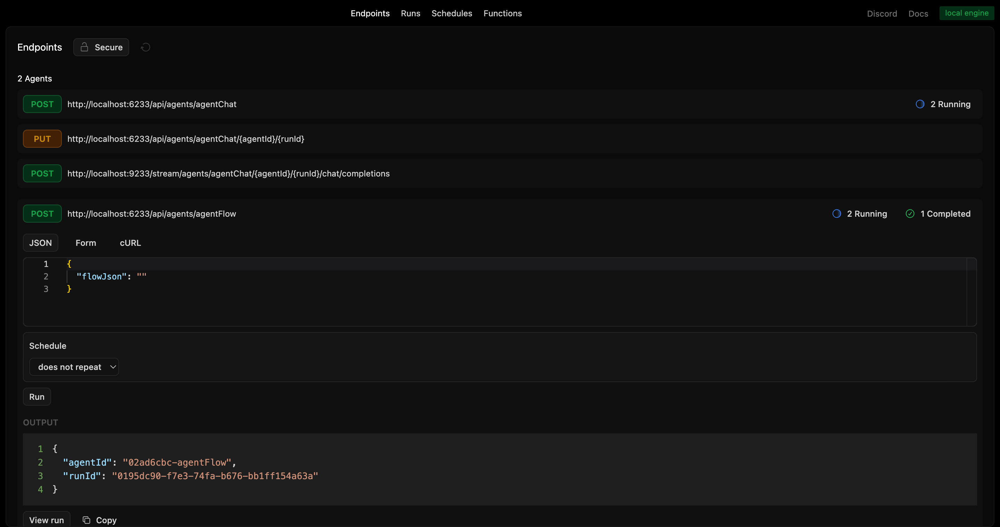
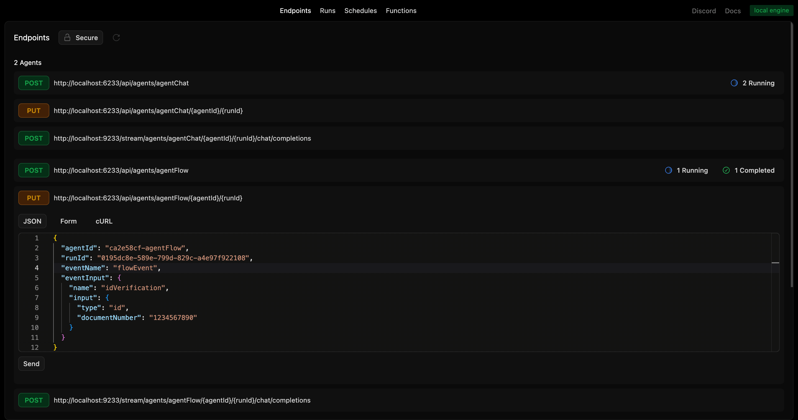
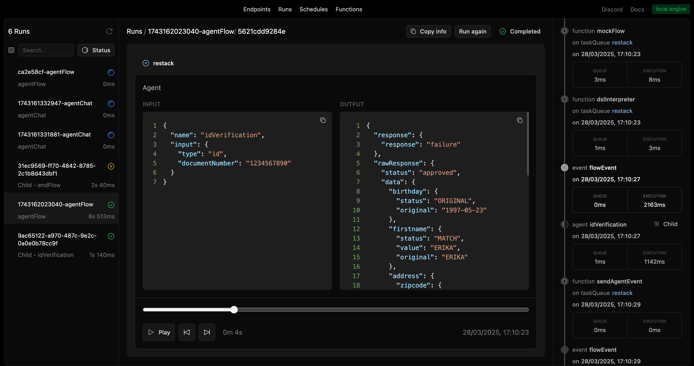

# Agent with React Flow

A sample repository to have low code editor with React Flow of Agents built with Restack.

See the full documentation on our [Agent with React Flow](https://docs.restack.io/blueprints/agent-reactflow) page.

### Apps

- `frontend`: a [Next.js](https://nextjs.org/) app
- `backend`: a [Restack](https://restack.io/) app

## Requirements

- **Node 20+**
- **pnpm** (recommended)

## Start Restack

To start Restack, use the following Docker command:

```bash
docker run -d --pull always --name restack -p 5233:5233 -p 6233:6233 -p 7233:7233 -p 9233:9233 -p 10233:10233 ghcr.io/restackio/restack:main
```

## Install dependencies and start services

```bash
pnpm i
pnpm run dev
```

Leveraging TurboRepo, this will start both frontend and backend.
Your code will be running and syncing with Restack to execute agents.

## Run agents

### From frontend


### from UI

You can run agents from the UI by clicking the "Run" button.



### from API

You can run agents from the API by using the generated endpoint:

`POST http://localhost:6233/api/agents/agentFlow`

### from any client

You can run agents with any client connected to Restack, for example:

```bash
pnpm schedule-agent
```

executes `scheduleAgent.ts` which will connect to Restack and execute the `agentFlow` agent.

## Send events to the Agent

### from Backend Developer UI

You can send events like or end from the UI.



And see the events in the run:



### from API

You can send events to the agent by using the following endpoint:

`PUT http://localhost:6233/api/agents/agentFlow/:agentId/:runId`

with the payload:

```json
{
  "name": "idVerification",
  "input": {
    "type": "id",
    "documentNumber": "1234567890"
  }
}
```

to send messages to the agent.

or

```json
{
  "eventName": "end"
}
```

to end the conversation with the agent.

### from any client

You can send event to the agent with any client connected to Restack, for example:

Modify agentId and runId in eventAgent.ts and then run:

```bash
pnpm event-agent
```

It will connect to Restack and send an events to the agent.

## Deploy on Cloud

### Deploy frontend on Vercel

Choose root directory as the project root.

Root directory

```
agent-reactflow/apps/frontend
```

Build command

```bash
turbo run build --filter=@agent-reactflow/frontend
```

### Deploy backend on Restack Cloud

To deploy the application on Restack, you can create an account at [https://console.restack.io](https://console.restack.io)

Custom Dockerfile path

```
/agent-reactflow/Dockerfile
```

Application folder

```
/agent-reactflow
```
